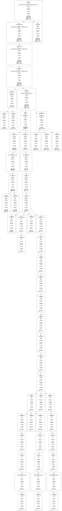
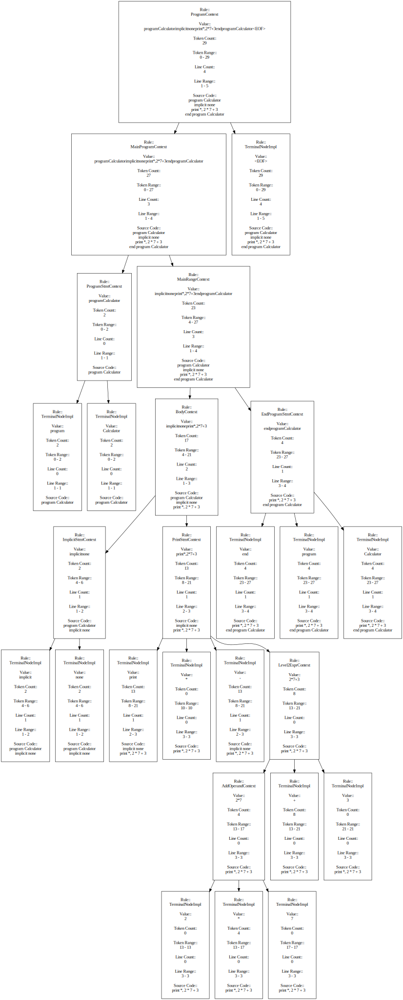

# FortranAS
FortranAS or Fortran Abstract Syntax is a FORTRAN parse tree and abstract syntax
tree generation tool based off of antlr4.
It takes as input a fortran source file and generates a parse tree and abstract
syntax tree both as a dot file, json file, SVG file and JSON files.

This tool support any Fortran version with grammer provided by:
[grammars-v4 🔗](https://github.com/antlr/grammars-v4/tree/master/fortran) 

FortranAS can be run locally with a fully self contained jar or with the
provided docker context.

## Background
FortranAS leverages [ANTLR4 🔗](https://www.antlr.org/) and 
[grammars-v4 🔗](https://github.com/antlr/grammars-v4/tree/master/fortran)
to to deconstruct FORTRAN source file and generate and serialize parse trees and
abstract syntax trees to the 
[GraphViz DOT language](https://graphviz.org/doc/info/lang.html) and json. The 
end goal is to be able to do code clone detection.

This project includes a gnu Makefile to build/generate the ANTLR4 lexers and
parsers, as well as, docker context.

GraphViz via the `dot` command is used to convert the output dot files to SVG.
GraphViz via the `dot` command is used to convert the output dot files to PNG.

## Supported Fortran versions
FortranAS in theory supports any fortran version that has associate grammars in
the project [grammars-v4 🔗](https://github.com/antlr/grammars-v4/tree/master/fortran).
 
There are currently grammars for Fortran77 and Fortran90.

## Source code transformations 

FortranAS supports the following transformations: 
- Fortran source to antlr4 parse tree text file
- Fortran source to JSON (both abstract syntax tree and parse tree)
- Fortran source to parse tree dot file
- Fortran source to abstract syntax tree dot file
- Fortran source to SVG (both abstract syntax tree and parse tree)
- Fortran source to PNG (both abstract syntax tree and parse tree)

## Prerequisites
You must have GNU Make and Docker installed.

> **ℹ️INFO:**
> FortranAS can only be built on Linux with Docker and GNU Make installed.  
> For local builds JDK 19 or better is required.  


## Usage
1. Clone the repository recursively 
```bash
git clone --recursive -j8 https://github.com/akoerner/FortranAS.git
```
2. Build everything:
```bash
cd FortranAS
make build
```

3. Run the examples:
```bash
make run_demo
```
The example will process all Fortran files provided in the `fortran_code_samples` 
directory.

Alternatively, you can drop your Fortran source code into the `fortran_source`
directory and run:
```bash
make run
```
If you have Fortran source in another path you can run:
```bash
make run SOURCE_DIRECTORY=$(realpath <some other fortran source directory>)
```

> **ℹ️INFO:**
> All output will be available in the `output` directory when run with the docker
> context.


> **ℹ️INFO:**
> This is a work-in-progress, more examples to come. 

## Running FortranAS locally
After building/packaging FortranAS you can run it locally with the 
provided launcher script via the generated jar file.
```
./fortranas -L Fortran90Lexer -o <absolute path to output directory> -i <absolute path to fortran source code>
```

FortranAS will use whatever grammars are provided by 
[grammars-v4 🔗](https://github.com/antlr/grammars-v4/tree/master/fortran)

## Antlr4 Grammars
FortranAS leverages the project [grammars-v4 🔗](https://github.com/antlr/grammars-v4/tree/master/fortran)
to generate lexers and parsers for Antlr4. This project contains a docker
context to build/compile the lexers and parsers provided by grammars-v4.
To build the Fortran grammars please review the provided documentation: 
[antlr4/README.md 🔗](antlr4/README.md)

When `make build` is invoked on this project the grammars are compiled and 
baked into the final output jar file which can be found in the `build` directory
after build.

To see what lexers/parsers have been packaged with FortranAS run the following 
command:
```bash
make list_lexers
```
or
```bash
./fortranas --list-lexers
```

## Generated Code

In order to compile and package with maven you must first run the code
generation. This involves the following process:


If built and packaged with make and docker you can simply invoke the build make
target:
```bash
make build
```

If you wish to work with FortranAS using an IDE you must first manually invoke
the code generation target before loading the project into your IDE with the
provided make target:
```bash
make generate_sources
```
This will invoke the first two steps in previously depicted build process. 

## Build artifacts
When invoking `make build` all associated build artifacts will be located in 
the `build` directory.

There is a stand alone jar generated as well as a launcher shell script.
FortranAS can be run locally, provided you have at least JRE 19.

To run FortranAS after running `make build` navigate to the build directory:
```
cd build
./fortranas --help
```
FortranAS can be placed anywhere on your system. The launcher shell script and
the jar package are required and must be in the same directory.


## Example output
The following is an example parse tree generated by this tool for the sample
Fortran program `fortran_code_samples/273.f90`

### Program: 273.f90
```Fortran
program Calculator
  implicit none
  print *, 2 * 7 + 3  
end program Calculator
```

### Antlr4 Parse Tree
```text
(program (executableProgram (programUnit (mainProgram (programStmt program Calculator) (mainRange (body (bodyConstruct (specificationPartConstruct (implicitStmt implicit none))) (bodyConstruct (executableConstruct (actionStmt (printStmt print (formatIdentifier *) , (outputItemList (expression (level5Expr (equivOperand (orOperand (andOperand (level4Expr (level3Expr (level2Expr (addOperand (multOperand (level1Expr (primary (unsignedArithmeticConstant 2)))) * (multOperand (level1Expr (primary (unsignedArithmeticConstant 7))))) + (addOperand (multOperand (level1Expr (primary (unsignedArithmeticConstant 3))))))))))))))))))) (endProgramStmt end program Calculator))))) <EOF>)
```
[Antlr4 Parse Tree String](example_outputs/273.f90.antlr4_parse_tree.txt)

### Parse tree DOT file and SVG
[Antlr4 Parse Tree DOT File](example_outputs/273.f90.parse_tree.dot)



### Abstract syntax tree DOT file and SVG 
[Antlr4 Parse Tree DOT File](example_outputs/273.f90.abstract_syntax_tree.dot)



More examples can be found in [example_outputs](example_outputs)

## Development Notes
FortranAS is a work-in-progress.


## Literature
