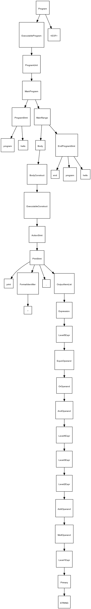
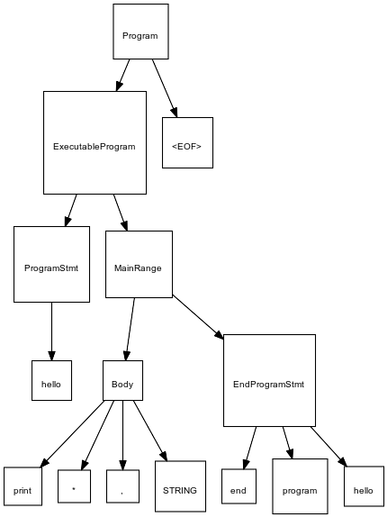

# FortranAS Artifacts
Every FORTRAN file discovered by **FortranAS** will be parsed and serialized 
(when FortranAS is supplied the `-p,--parse-fortran-files` flag) in a
number of formats. This section will detail all of the outputs generated by
**FortranAS**. All output files will be placed in the output directory supplied
by `-o,--output-directory <arg>` (Default output directory: `./output`).

All output files will be prefixed by the original input FORTRAN source code
file name.


## `<FORTRAN file name>.json`
This is a top level serialization artifact provided by **FortranAS**. This file
will contain all tokens parsed by Antlr4, what lexer was used and metadata
regarding the input FORTRAN source code file. This file will also contain the
Antlr4 parse tree string which will also be saved to 
`<FORTRAN file name>.antlr4_parse_tree.txt`. 

## `<FORTRAN file name>.antlr4_parsing.log`
This log file will contain all Antlr4 parser output generated by the input file. 
If there are Antlr4 parsing errors review this file for the input file in
question.

## `<FORTRAN file name>.log`
This is a general log file for **FortranAS** for the input FORTRAN file. It
contains the same data as `<FORTRAN file name>.json` unstructured. 


## `<FORTRAN file name>.antlr4_parse_tree.txt`
This file will contain the Antlr4 parse tree string.

Parse tree string example:
```text
(program (executableProgram (programUnit (mainProgram (programStmt program hello) (mainRange (body (bodyConstruct (executableConstruct (actionStmt (printStmt print (formatIdentifier *) , (outputItemList (expression (level5Expr (equivOperand (orOperand (andOperand (level4Expr (level3Expr (level2Expr (addOperand (multOperand (level1Expr (primary \u0027Hello, World!\u0027)))))))))))))))))) (endProgramStmt end program hello))))) \u003cEOF\u003e)
```
## `<FORTRAN file name>.parse_tree.json`
This file contains the Antlr4 parse tree converted to a generic tree data
structure and annotated with available metadata serialized as JSON.

## `<FORTRAN file name>.abstract_syntax_tree.json`
This file contains a translated version of the generic parse tree. The parse
tree is translated to a abstract syntax tree by applying strategies to prune, 
promote, replace, and merge nodes.  


## `<FORTRAN file name>.parse_tree.dot`
This is the same data structure provided by `<FORTRAN file name>.parse_tree.json`
represented in a GraphViz DOT format for visualization. This can be converted to
`svg` and `png` by using the shell script [tools/dot_converter.sh](../tools/dot_converter.sh). 

Example parse tree DOT file for `hello_world.f90`:




## `<FORTRAN file name>.abstract_syntax_tree.dot`
This is the same data structure provided by `<FORTRAN file name>.abstract_syntax_tree.json`
represented in a GraphViz DOT format for visualization. This can be converted to
`svg` and `png` by using the shell script [tools/dot_converter.sh](../tools/dot_converter.sh). 

Example abstract syntax tree DOT file for `hello_world.f90`:




